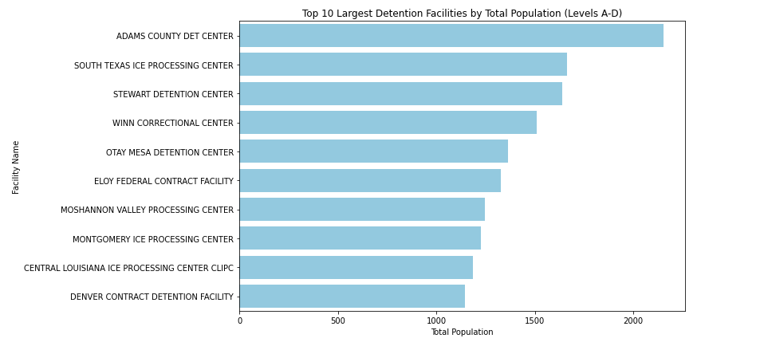

# Detention Facilities Data Cleaning and Visualization

This project involves cleaning and analyzing data from a CSV file (`messy_ice_detention.csv`) containing information about ICE detention facilities in the U.S. The final output displays the top 10 facilities by population and a bar chart for visual comparison.

## 📝 Description

The raw dataset is messy and includes:
- Extra header rows
- Special characters in text fields
- Various representations of missing data (e.g., `"NA"`, `" "`, `"null"`)
- Some missing or incorrect values correction
- Misformed dates

The notebook performs:
- Data loading with encoding handling
- Data cleaning (e.g., removing special characters from names)
- Changed dates from  serial date numbers (excel series) format to readable date format
- Missing value handling and replacements
- Updates for specific erroneous rows
- Calculation of total population from individual population levels
- Visualization using Seaborn and Matplotlib

## Top 10 Facilities by Population

## Visualization
